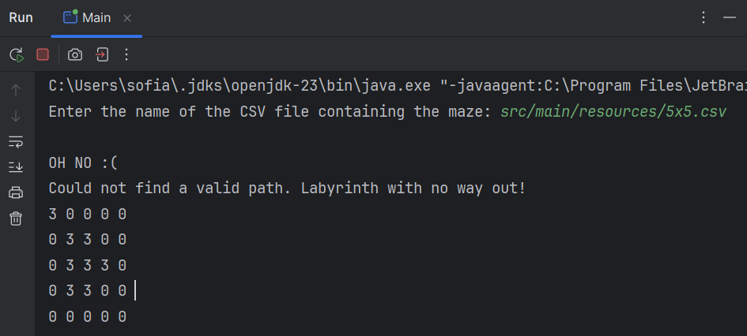

# Maze
_Practical Assignment I of the Advanced Programming Techniques course [2024/2], taught by Prof. Mateus Costa at Instituto Federal de Ciência e Tecnologia do Espírito Santo (IFES)._

**Authors**
- Manoel Rodrigues Loureiro - [@ManoelRL](https://github.com/ManoelRL)
- Sofia de Alcantara - [@sofialctv](https://github.com/sofialctv)

# Objective
The objective of this assignment is to implement a program in **Java** that
solve mazes represented by matrices of `0` and `1`. In the context of this
maze, the numbers `0` represent walls, while the numbers `1` represent paths. Each maze has a single entrance and a single
exit, ensuring that there is always a path that connects these two points.
**However, the maze may contain dead ends.**

📂 More information about the activity proposal can be read in the file [especificacao.pdf](/especificacao.pdf) [PT-BR].

# Project Structure
The project contains the following files:
- `Main.java`: Contains the entry point for the program. It prompts the user for the name of a CSV file that contains the maze, then initializes and solves the maze using the MazeSolver class.

- `Maze.java`: This class is responsible for reading the maze from a CSV file and storing the maze's data as a grid of rows and columns. It also provides helper methods for maze traversal and rendering.

- `MazePanel.java`: This class is responsible for the graphical representation of the maze using **Java's Swing** components. It handles the drawing of the maze and the animation of the solver as it moves through the maze.

> 

> _Output example using a 15x30 maze. The color BLACK represents walls, while WHITE represents possible paths. The GREEN squares are part of the "solution path", while the RED ones have been backtracked._

- `MazeSolve.java`: This class implements the maze-solving algorithm using a **backtracking approach**. It explores all possible directions from the current position and marks the correct path once the exit is found.

- `Posiion.java`: This class represents a position in the maze with x and y coordinates. It is used to track the player's position as the solver moves through the maze.

📂 Example mazes have been made available in [src/main/resources](/src/main/resources).

# How the Maze Solver Works
- **Input:** The maze is read from a CSV file where 0 represents a wall and 1 represents a valid path. The start of the maze is at the top-left corner (0, 0) and the exit is at the bottom-right corner. ⚠️ **Use the path from content root**
- **Backtracking Algorithm:** The solver starts at the entrance and recursively explores all possible directions (north, northeast, east, southeast, south, southwest, west and northwest - follow anticlockwise order). It uses a stack to keep track of the path. If the solver reaches a dead end, it backtracks and explores a different path. The algorithm continues until it reaches the exit.
- **Graphical Representation:** As the solver moves through the maze, the graphical interface updates to show the current position of the solver and the path it has taken.

# Output Example
The program will display the path from the entry point to the exit, or an error message if there is no viable path.
 

> _From the graphical representation of the maze we can see that no exit was found. In the terminal we have the confirmation message that the maze does not have an exit, followed by a string representation of the maze where the number "3" is used to indicate that the coordinate was visited, but is not part of the solution path (it was backtracked)._

# How to Compile and Run the Project from the Command Line

## **Prerequisites**
Ensure you have the following installed:
- **Java Development Kit (JDK)** version 8 or higher. You can download the latest version of the JDK from the [official Oracle website](https://www.oracle.com/java/technologies/javase-jdk11-downloads.html).
- **Maven** (Make sure Maven is added to your system's PATH)

## Compilation and Running Steps
1. **Clone the Repository (if needed):**
> git clone <repository-url>
cd <repository-directory>

2. **Navigate to the Project's Root Directory:** Make sure you're in the folder containing the `pom.xml` file.
> cd C:\YourFolder\maze

3. **Compile the Project:** Use Maven to compile the project and download any dependencies defined in `pom.xml`.
> mvn compile

4. **Run the Project:** Once the project is compiled, you can run the Main class using the following command:
> mvn exec:java -Dexec.mainClass="com.tpa.maze.Main"

Alternatively, if you want to run the project from the target folder after building:
> java -cp target/classes com.tpa.maze.Main

5. **Test Different Mazes:** You can test different mazes by providing the file path to a `.csv` file as prompted by the program. For example, you can use the maze files available in the `resources` folder:
> **Enter the name of the CSV file containing the maze:** src/main/resources/15x30.csv
